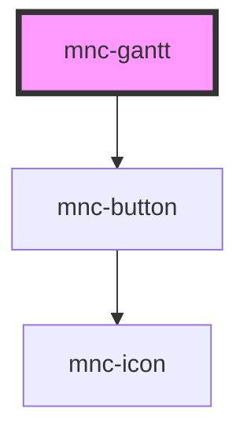

# mncgantt

<!-- Auto Generated Below -->

## Properties

| Property   | Attribute | Description   | Type | Default     |
| ---------- | --------- | ------------- | ---- | ----------- |
| `taskdata` | --        | The task data | `{}` | `undefined` |

## Methods

### `gZoomIn() => Promise<void>`

#### Returns

Type: `Promise<void>`

### `gZoomOut() => Promise<void>`

#### Returns

Type: `Promise<void>`

### `updateCriticalPath(toggle: any) => Promise<void>`

#### Parameters

| Name     | Type  | Description |
| -------- | ----- | ----------- |
| `toggle` | `any` |             |

#### Returns

Type: `Promise<void>`

## Dependencies

### Depends on

- [mnc-button](../button)

### Graph

----------------------------------------------

*Built with [StencilJS](https://stenciljs.com/)*
